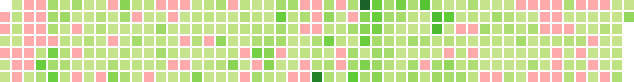

# py-calendar-heatmap
Generate an svg calendar heatmap - similar to GitHub and others' - from several sources of contribution data.  
[data.md](data.md) shows example data from each source.

### Usage
- Supports contributions from eBird (checklists), Observation.org and iNaturalist (observations), GitHub (commits), and OpenStreetMap (changesets).
- Run `main.py` to generate the svg output, which can then be included in a webpage as an `img` or `object`.

Hovering over a date square displays a tooltip with the date and number of contributions.

### Future Improvements
- Interactive calendar (select sources to display) with color legend
- Option to use empty instead of red for zero dates
- Add Mediawiki source option, for Wikipedia and others
